# RAN·FEED

[中文](/README.md) | [English](/README_EN.md)

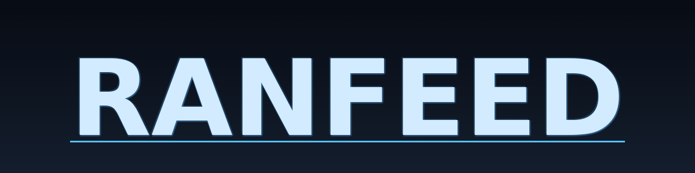

**Content/feed backend system**, covering key experience scenarios such as publishing, interaction, and recommendation/following feeds.


---


## Table of Contents
- [Overview](#overview)
- [Tech Stack](#tech-stack)
- [Project Showcase](#project-showcase)
- [Technical Architecture](#technical-architecture)
- [Business Architecture](#business-architecture)
- [Structure](#structure)
- [Quick Start](#quick-start)
- [Configuration](#configuration)
- [Deployment](#deployment)
- [Next Development Plan](#next-development-plan)
- [License](#license)

---

## Overview
- **Content**: publish articles/videos, content detail
- **Interaction**: like/favorite/comment/follow
- **Counting**: aggregation for likes/favorites/comments
- **Feed**: follow feed, recommendation feed

---

## Tech Stack
- Go
- go-zero
- MySQL
- Redis
- Kafka
- Canal
- XXL-Job
- ELK
- Prometheus
- Grafana
- Jaeger
- OpenTelemetry
- Nginx
- Docker Compose

---

## Project Showcase

### Demo (Front/Business)
| Scenario | Screenshot |
| --- | --- |
| Recommendation Feed | 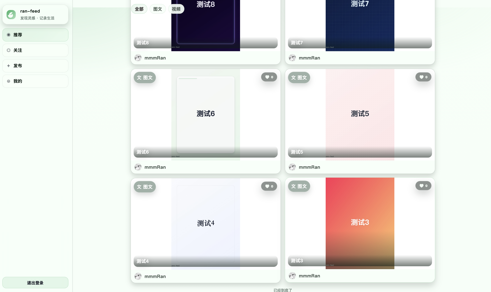 |
| Following Feed | 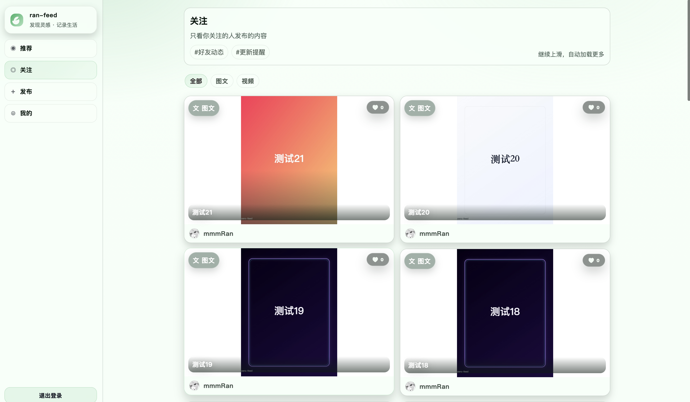 |
| Content Detail / Comments | 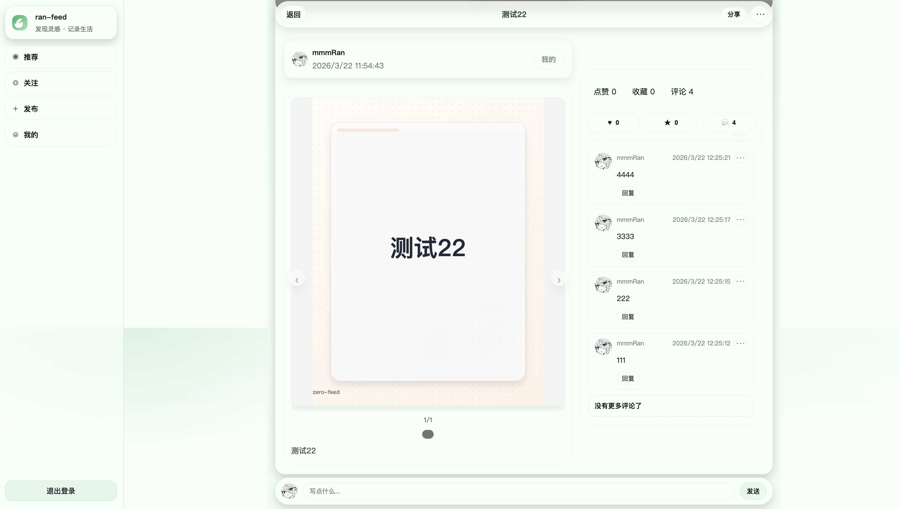 |
| Publish Content (Image/Video) | 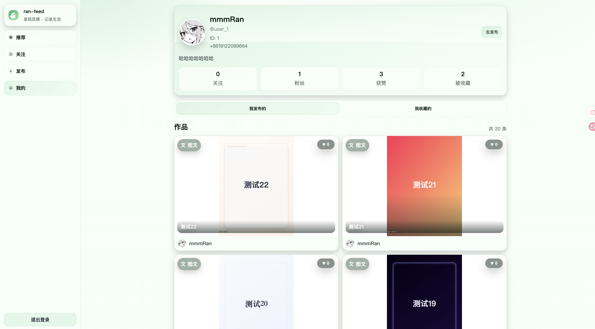 |
| Publish Article | 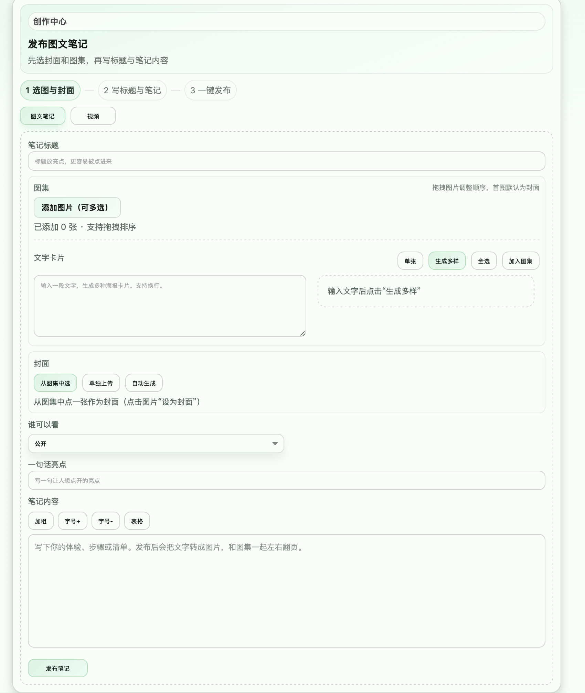 |
| Publish Video | 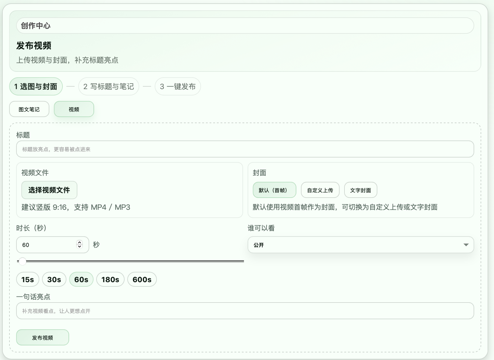 |

### Infrastructure & Observability
| Module | Screenshot |
| --- | --- |
| XXL-Job | 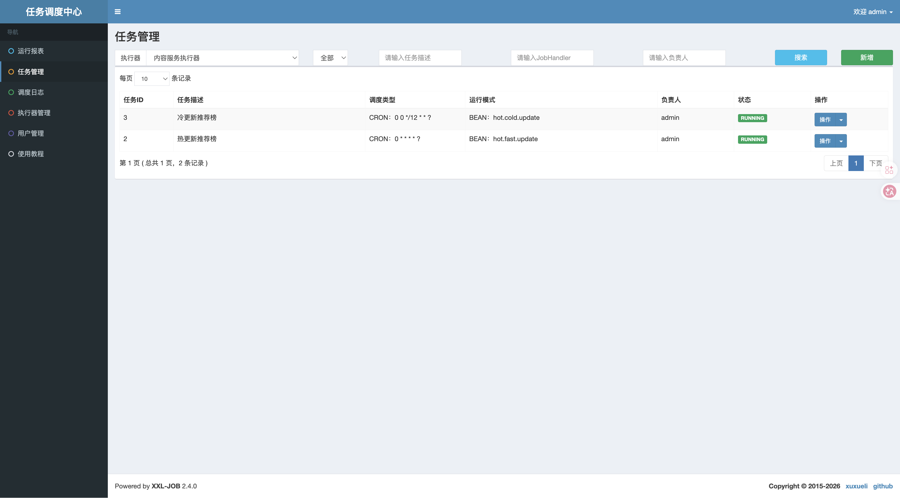 |
| Jaeger Tracing | 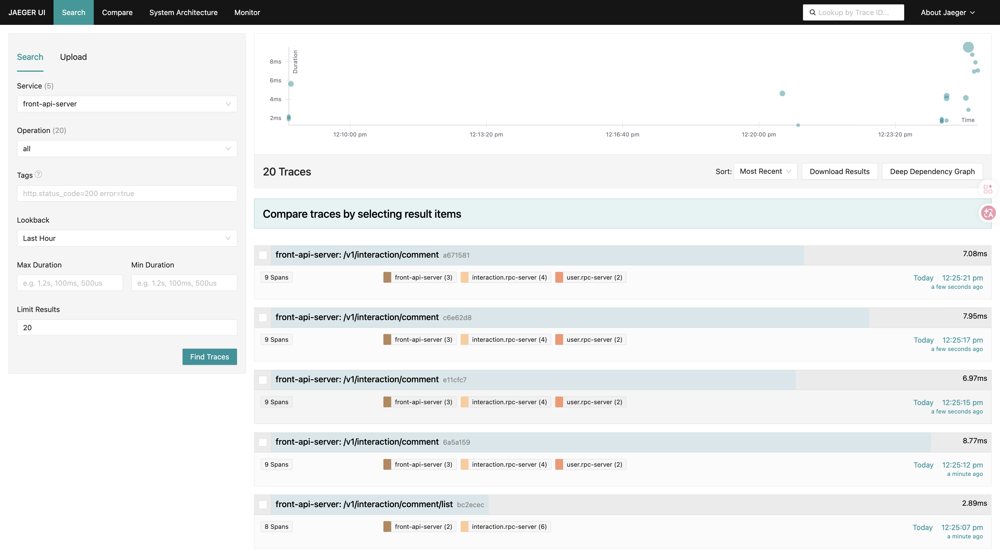 |
| Grafana Dashboard | 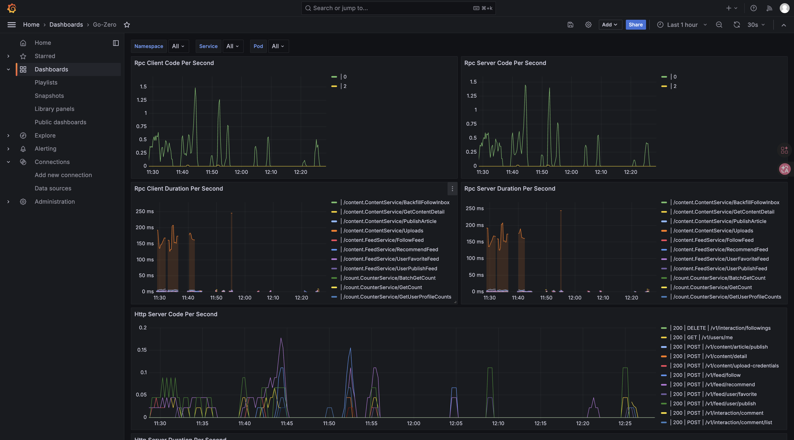 |
| Kibana / ELK | 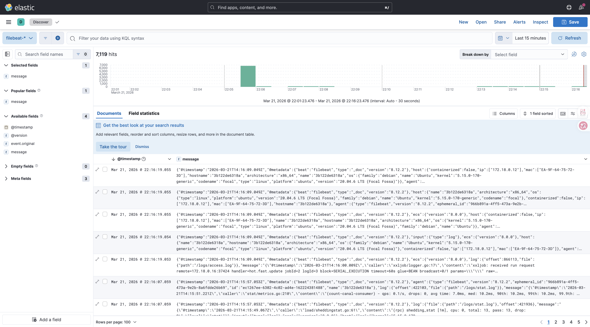 |

---

## Technical Architecture
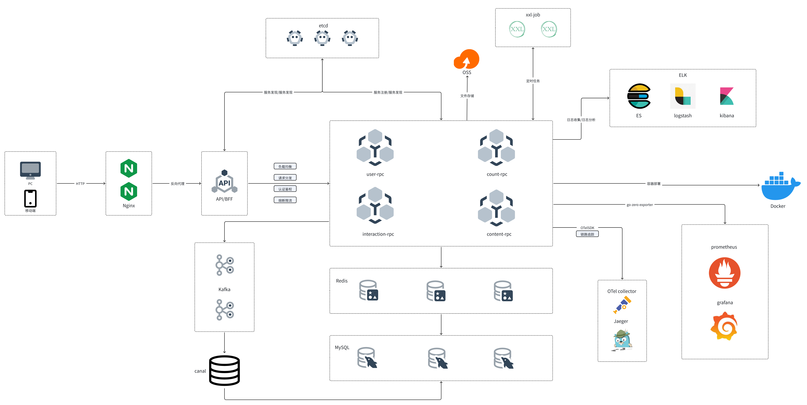

---

## Business Architecture
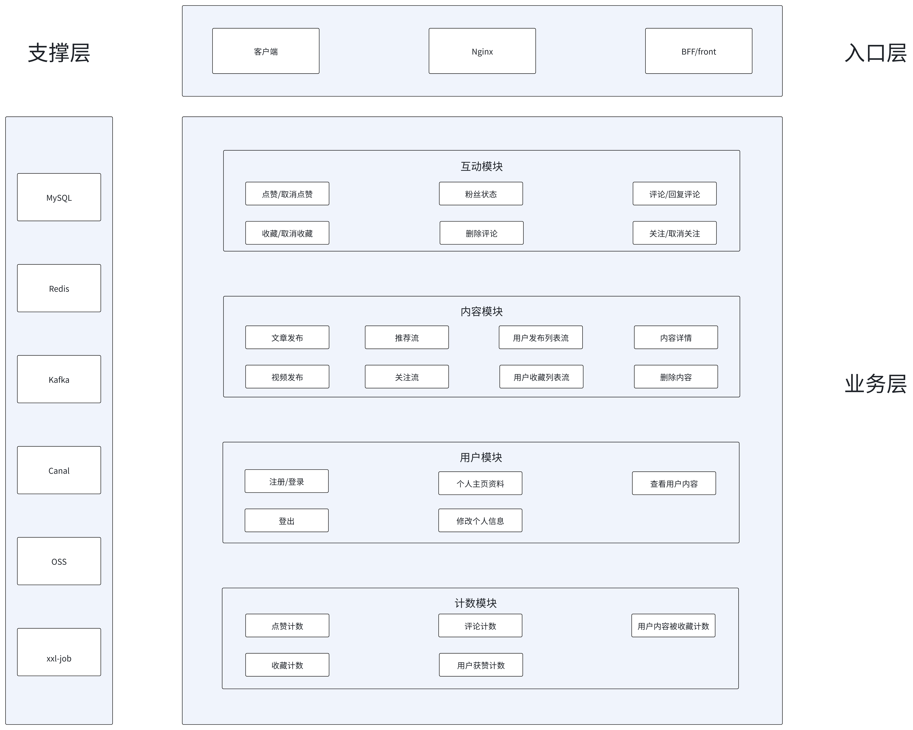

---

## Structure
```
app/                # Services
  front/            # HTTP API
    etc/            # Service config
    internal/       # Implementation
  rpc/              # RPC services
    content/        # Content domain
    interaction/    # Interaction domain
    user/           # User domain
    count/          # Count domain
build/              # Dockerfile
deploy/             # docker-compose
pkg/                # Shared libs
script/             # SQL + scripts
```

---

## Quick Start
### 1. Prerequisites
- Recommended: **Ubuntu 22.04** (suggested for the one-click startup via Docker Compose)
- Docker + Docker Compose
- Go (local dev)

### Notes
- Please fill OSS settings in `.env` (do not commit real secrets):
  - `OSS_PROVIDER`: cloud provider (e.g. `aliyun`)
  - `OSS_REGION`: region (e.g. `cn-beijing`)
  - `OSS_BUCKET_NAME`: bucket name
  - `OSS_ACCESS_KEY_ID` / `OSS_ACCESS_KEY_SECRET`: access keys
  - `OSS_ENDPOINT`: upload endpoint
  - `OSS_UPLOAD_DIR`: upload dir prefix
  - `OSS_PUBLIC_HOST`: public host
  - `OSS_ROLE_ARN`: optional, for role-based access

### 2. Start
```bash
./script/start.sh
```
**Access after startup: `http://localhost`**

### 3. Stop
```bash
./script/stop.sh
```

---

## Configuration
Configs are in `app/**/etc/*.yaml`.

Env vars are injected via `${VAR}`:
- Local: `.env`
- Docker: `deploy/.env`

Recommended to set these first:
- Data: `MYSQL_HOST` / `REDIS_HOST` / `ETCD_HOST` / `KAFKA_BROKERS`
- Observability: `OTEL_ENDPOINT` / `LOG_PATH` / `PROM_HOST`
- OSS: `OSS_PROVIDER` / `OSS_REGION` / `OSS_BUCKET_NAME` / `OSS_ACCESS_KEY_ID` / `OSS_ACCESS_KEY_SECRET` / `OSS_ENDPOINT` / `OSS_UPLOAD_DIR` / `OSS_PUBLIC_HOST`

Example (container):
```
MYSQL_HOST=mysql
REDIS_HOST=redis
ETCD_HOST=etcd
KAFKA_BROKERS=kafka:9092
OTEL_ENDPOINT=otel-collector:4317
LOG_PATH=/var/log/ran-feed
PROM_HOST=0.0.0.0
OSS_PROVIDER=aliyun
OSS_REGION=cn-beijing
OSS_BUCKET_NAME=your-bucket
OSS_ACCESS_KEY_ID=your-key-id
OSS_ACCESS_KEY_SECRET=your-key-secret
OSS_ENDPOINT=https://oss-cn-beijing.aliyuncs.com
OSS_UPLOAD_DIR=uploads
OSS_PUBLIC_HOST=https://your-bucket.oss-cn-beijing.aliyuncs.com
```

---

## Deployment
Use Docker Compose (`deploy/docker-compose.yml`).

Basic flow:
1. Enter `deploy/`, prepare `.env` (copy from root `.env` and adjust).
2. Start:
```bash
cd deploy
docker compose --env-file .env up -d --build
```
3. Verify:
```bash
docker compose ps
```
4. Stop:
```bash
docker compose down
```

---

## Next Development Plan
- Improve rec/follow feeds (basic refinement)
- Comments and interaction notifications
- Profile feed aggregation (posts/favorites)
- Hot content and ranking improvements
- Search (content/users)
- IM / direct messaging (basic chat)

---

## License
MIT
